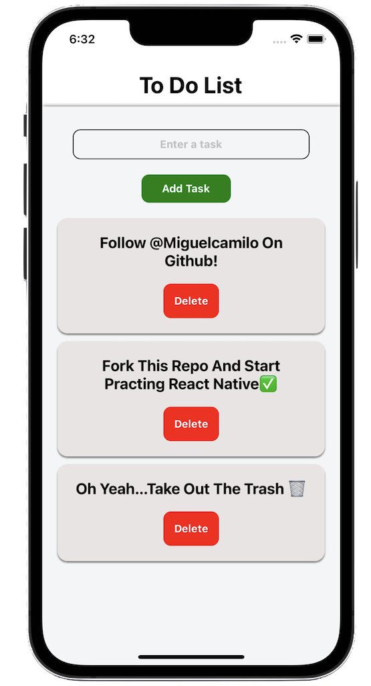

<h1 align="center">{ Full Stack TodoList Mobile App } 💻 </h1>

## Project Image

<!-- TABLE OF CONTENTS -->

## Table of Contents

- [Overview](#overview)
  - [Built With](#built-with)
- [Features](#features)
- [Contact](#contact)

<!-- OVERVIEW -->

## Overview
- This is a simple to-do list app that allows users to add tasks and view them in a list. The app is built using React Native and utilizes the useState hook to manage the state of the tasks.
Overall, this app provides a simple and easy to use interface for managing and viewing tasks.

## What Did I Learn?
- What have you learned/improved?
  - How to build an API connected to a database and using C.R.U.D (Create / Read / Update / Delete )
  - Working on this project helped me develop my skills with React Native and get a better understanding of React Native Components and useState Hooks

### Built With

<!-- This section should list any major frameworks that you built your project using. Here are a few examples.-->

- [React](https://reactjs.org/)
- [ReactNative](https://reactnative.dev)
- [Expo](https://expo.dev)

## Features

- The App component has two main functions, handleAddTask and deleteTask. The handleAddTask function is called when the user taps on the plus icon and adds the current task to the taskItems array. The deleteTask function is called when the user taps on the delete icon next to a task, and it removes that task from the taskItems array.
- The Task component is a simple component that takes a single prop, text, and displays it as a Text component.

## 🔗 Contact Links

